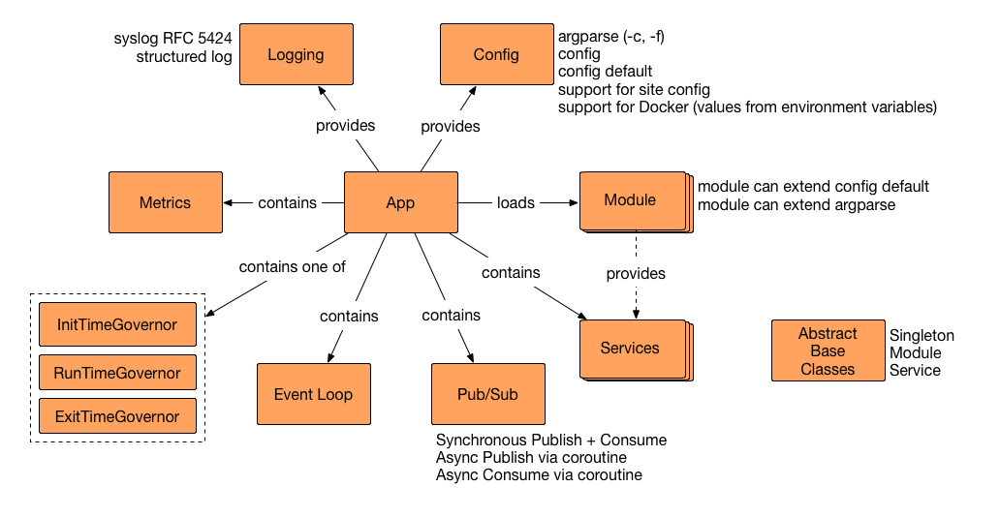

# Asynchronous Server Application Boilerplate

Asynchronous Server App Boilerplate (or _ASAB_ for short) minimizes the amount of code that one needs to write when building a server application in Python 3. The lead author has designed and coded various application servers (not only) in Python and this project represents a knowledge capture of the best approaches.

I hope you will find _ASAB_ useful and fun to use, especially when you are about to build a Python-based application server such as REST web server, MQTT-consuming application backend server, ETL or data pump.

Have fun!

## Principles

 * Write once, use many times
 * Keep it simple
 * Python 3.5+, compatible with pypi
 * Asynchronous via `asyncio`
 * [Event-driven](http://en.wikipedia.org/wiki/Event_driven) / [Reactor pattern](https://en.wikipedia.org/wiki/Reactor_pattern)
 * Single-threaded core but compatible with threads
 * Introspection supported
 * Modularized
 * Good documentation

## High-level architecture

